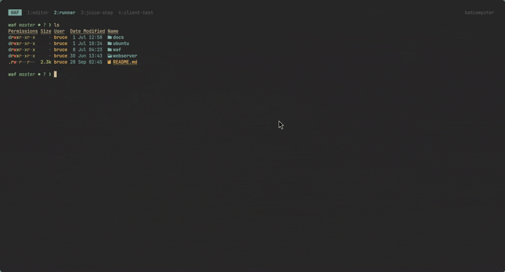

# WAF Reverse Proxy

A reverse proxy written in Go, with request inspection powered by
[Coraza](https://github.com/corazawaf/coraza) (a ModSecurity-compatible
WAF engine) and the [OWASP Core Rule Set](https://github.com/coreruleset/coreruleset),
sitting in front of [OWASP Juice Shop](https://owasp.org/www-project-juice-shop/)
as a demo backend.

## Architecture

```
Client → wafHandler (Coraza inspection, request phase) → ReverseProxy → Juice Shop
```

Every incoming request goes through Coraza's phases 0 to 2 (connection,
URI/headers, request body). If the CRS anomaly score exceeds the
configured threshold, the request is rejected with a 403 before it
ever reaches the backend. Otherwise, it's forwarded unchanged to the
reverse proxy.

## Project status

- [x] Basic reverse proxy (no inspection)
- [x] Coraza integration — request-phase inspection (URI, headers, body)
- [ ] Response-phase inspection (headers/body)
- [ ] Configuration via file/environment variables (backend URL, port)
- [ ] Structured audit logging

## Requirements

- Go 1.26+
- Docker (to run Juice Shop locally)

## Installation

The OWASP CRS ruleset is included as a git submodule — a plain clone
won't fetch it automatically:

```bash
git clone --recurse-submodules <this-repo-url>
```

If you already cloned without that flag:

```bash
git submodule update --init --recursive
```

## Running locally

```bash
# Terminal 1: the backend (Juice Shop)
docker run -p 3000:3000 bkimminich/juice-shop

# Terminal 2: the WAF
cd waf/app
go run main.go
```

The proxy listens on `:8080` and forwards to `http://127.0.0.1:3000`.

## Testing

```bash
# Normal request — 200
curl -i http://localhost:8080/

# SQL injection attempt — blocked with a 403
curl -i "http://localhost:8080/rest/products/search?q=1'%20OR%20'1'='1"
```

## Demo

Short walkthrough showing the WAF in action:

1. Juice Shop running in Docker, in its own terminal pane
2. The WAF proxy started in a second pane (`go run main.go`)
3. A normal request returning `200 OK`
4. A SQL injection attempt returning `403 Forbidden`, with the matched
   Coraza/CRS rule visible in the WAF's logs



## License

This project is licensed under the [MIT License](LICENSE).
